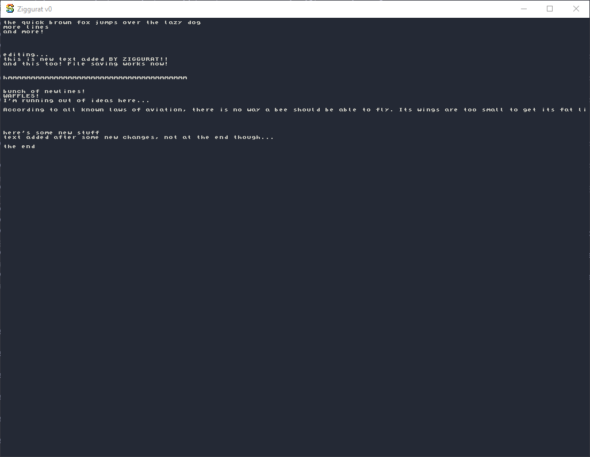

# Ziggurat
A blazingly fast GUI-based text editor written in Zig. Meant to do everything that notepad does, but better.

Currently, it's in a bare-minimum viable v0 form. However, the core functionality it present.

## Build Process

By default, the build script produces 4 binaries:

Two targets:
- Whatever system you build on
- x86_64 Windows

Don't ask me what happens if your system *is* x86_64 windows, I don't know.

Two programs:
- `Ziggurat`: the actual text editor
- `test-engine`: a CLI for testing and benchmarking the underlying text buffer

## Features and Usage

- Smoothly opens, edits, and saves multi-GB files
    - Opens are O(1)
    - The full file is never loaded into RAM even on save. Reads and writes are streamed directly to/from disk.
- Supports all standard mouse + keyboard navigation
- Infinite undo/redo supported
- Supports most word and line granular selection and navigation with similar semantics to VSCode
- If launched with no command-line args, it opens an empty unsavable scratch document
- If launched via CLI with `Ziggurat.exe <file_path>` it will open that text file for editing or create one
- Save with `ctrl-s` and exit with `ctrl-d`

## Limitations

Each of these is being addressed on the way to v1. 

- No file renaming
- No scaling or font support
- No text wrapping
- ASCII only, for now

